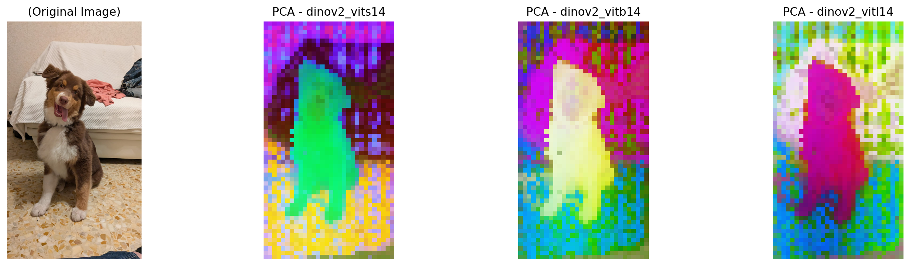

# vis_pca_dino
# Dino模型的PCA评估项目

此项目旨在通过PCA（主成分分析）对Dino深度学习模型中的各个版本进行特征提取与评估，并通过K-Means聚类进一步分析各模型的性能。

## 项目目标

利用PCA技术，通过可视化和量化评估以比较Dino模型的不同版本性能，包括：
- `dinov2_vits14`: 小模型
- `dinov2_vitb14`: 基础模型
- `dinov2_vitl14`: 大模型

## 可视化结果

